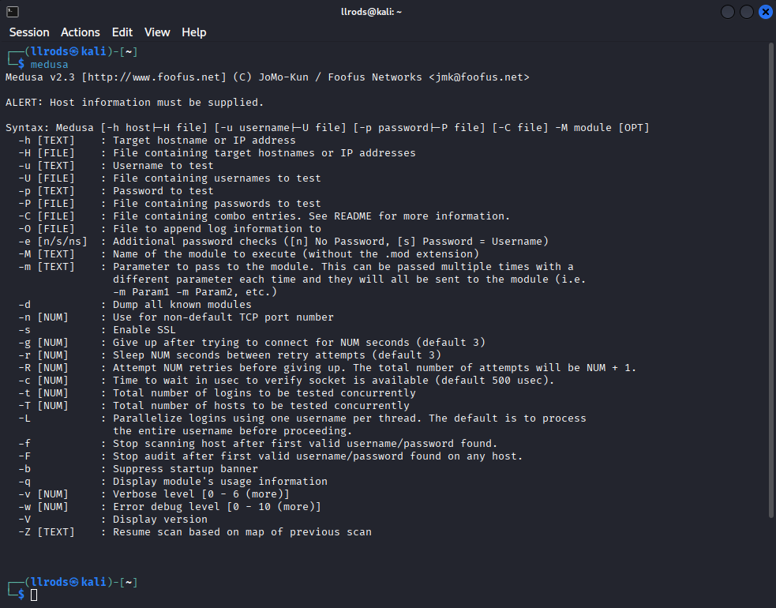
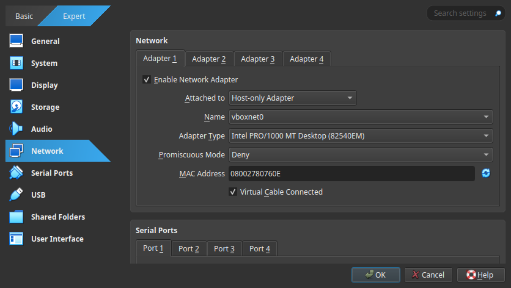
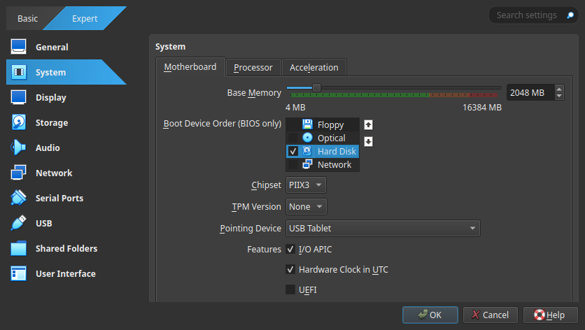
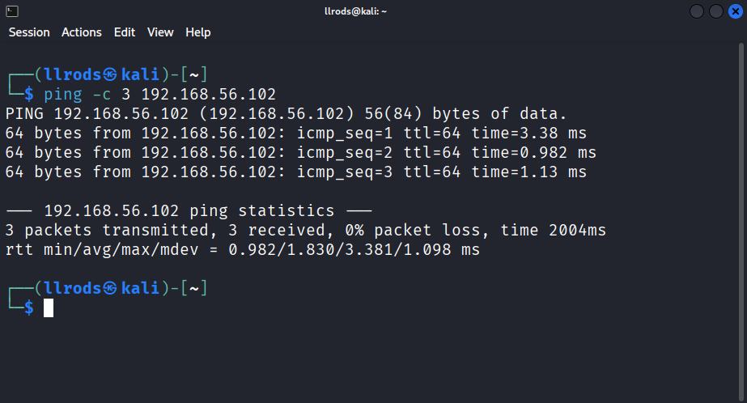
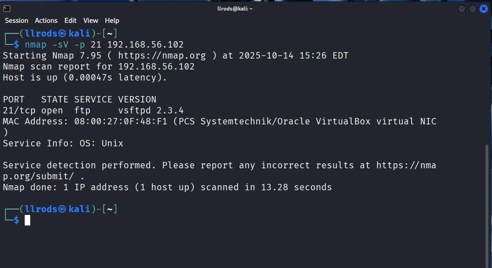
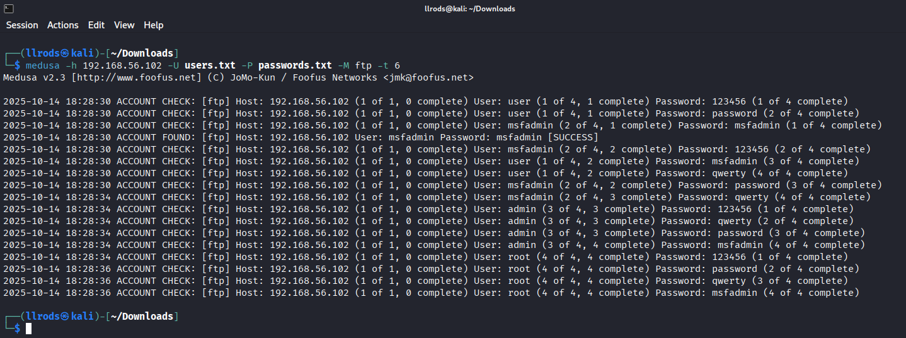
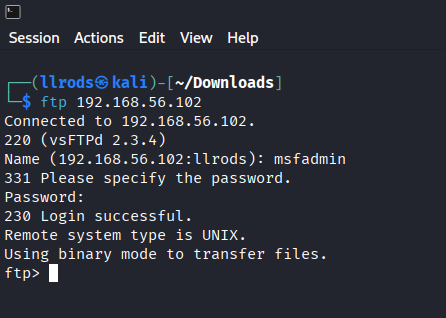

# Brute-Force com Medusa (FTP — Metasploitable)

Relatório e passo a passo de um exercício prático de segurança: uso da ferramenta **Medusa** para testes de força bruta contra um servidor **FTP** em uma VM **Metasploitable**. O objetivo é demonstrar a técnica em um ambiente controlado e fornecer recomendações de mitigação.

> Ambiente: VirtualBox (Host-Only), Kali Linux (atacante) e Metasploitable (alvo).  
> Escopo: somente máquinas próprias/VMs para fins educativos — não realizar testes sem autorização.

---

Ataques de força bruta são utilizados para tentar descobrir senhas, realizando múltiplas tentativas de diferentes combinações de usuário e senha. Um processo que, manualmente, seria demorado; ferramentas como **Medusa** podem torná-lo mais rápido e eficiente.  
Aqui demonstrarei como utilizar essa e outras ferramentas para simular um ataque a um servidor, com o objetivo de validar a existência de falhas de segurança.

> Atenção! 
> Ataques de força bruta são ilegais, a menos que sejam realizados em sistemas de sua propriedade ou com permissão explícita do proprietário. Este guia descreve ferramentas e procedimentos apenas para fins de estudo.

---

## Medusa

Medusa é uma ferramenta de linha de comando de código aberto, projetada para ataques de **força bruta** rápidos. Profissionais de segurança podem utilizá-la para identificar senhas fracas ou serviços mal configurados em sistemas, permitindo a correção antes que ataques reais ocorram.

A ferramenta é altamente otimizada para trabalhar com multithreading, permitindo testar uma grande quantidade de nomes de usuário e senhas em paralelo, o que acelera o processo. Ela suporta vários protocolos (FTP, SSH, RDP etc.) de forma modular, permitindo adicionar ou habilitar módulos conforme necessário.

## Instalação

Utilizei o Kali Linux para esta demonstração, que já traz a ferramenta instalada. Caso seja necessário instalar no Debian/Ubuntu/Kali:

```bash
sudo apt update
sudo apt install medusa
```

Verifique a instalação digitando `medusa` no terminal. Se instalado corretamente, será exibido o menu de ajuda do Medusa.



## Sintaxe

Sintaxe básica de uso:

```bash
medusa -h <target IP> -U <arquivo_usuarios> -P <arquivo_senhas> -M <m�dulo> -t <threads>
```

| Flag | Ação                                                           |
| ---- | -------------------------------------------------------------- |
| *-h* | Especifica o host de destino (endereço IP ou nome de domínio). |
| *-U* | Caminho para o arquivo com a lista de usuários.                |
| *-P* | Caminho para o arquivo com a lista de senhas.                  |
| *-M* | Módulo/protocolo a ser testado (ex.: `ftp`, `ssh`).            |
| *-t* | Número de threads para conexões paralelas (padrão: 16).        |

Existem outros parâmetros específicos para cada protocolo. Consulte o manual:

```bash
man medusa
```

---

## Configuração do Ambiente

Para um ambiente seguro de estudos, criei máquinas virtuais no **VirtualBox**, usando **Kali Linux** como atacante e **Metasploitable** como alvo.

#### VirtualBox

É um software gratuito e multiplataforma para criar e gerenciar máquinas virtuais. Permite isolar sistemas para testes com segurança.

Para instalar, baixe a versão para o seu sistema operacional e siga as instruções encontradas na própria página de download.

*Mais informações e Download:* [*VirtualBox*](https://www.virtualbox.org/)

#### Kali Linux

Distribuição Linux voltada a testes de penetração e análise forense digital. Pode ser usada via ISO ou importando a VM pronta para VirtualBox disponível no site.

Após criar a VM, nas configurações de **Network** configure o adaptador como **Host-Only Adapter** para que Kali e Metasploitable fiquem na mesma rede isolada.



 *Mais informações e Download:* [*Kali Linux*](https://www.kali.org/get-kali/#kali-platforms)

#### Metasploitable

Metasploitable é uma VM intencionalmente vulnerável usada para treinamento. O arquivo baixado vem como disco virtual (ex.: `Metasploitable.vdi`). No VirtualBox, crie uma VM do tipo Linux/Ubuntu e, na aba **Storage**, substitua o disco virtual pelo `Metasploitable.vdi` baixado.


Na aba **System**, altere o **Boot Device Order**, deixe selecionado apenas a opção **Hard Disk**, para que a maquina inicie pelo disco configurado.



Configure a rede da VM Metasploitable também como **Host-Only Adapter** e inicie a VM. Use o usuário msfadmin e a senha msfadmin para login.

 *Mais informações e Download:* [*Metasploitable*](https://sourceforge.net/projects/metasploitable/)

#### Teste de Conexão

No Metasploitable, verifique o IP com `ifconfig` (ou `ip addr`). No meu caso: `192.168.56.102`. No Kali, teste com:

```bash
ping -c 3 192.168.56.102
```

Se houver resposta, a rede está configurada corretamente.



---

## Exemplo de Uso

Usei o servidor FTP do Metasploitable como alvo, simulando um cenário de avaliação em um servidor antigo.

#### Enumeração

Primeira etapa: enumeração de serviços com **nmap**. Para verificar a porta 21 (FTP):

```bash
nmap -sV -p 21 192.168.56.102
```

O parâmetro `-p 21` especifica a porta e `-sV` tenta identificar a versão do serviço.



A versão do serviço é informação valiosa, pois indica potenciais vulnerabilidades conhecidas (ex.: [CVEs](https://nvd.nist.gov/vuln/detail/CVE-2011-2523)) que podem ser pesquisadas posteriormente. Neste caso, não explorei essa vulnerabilidade — o foco foi brute force.

> Observação: 
> Como o foco é o brute force com Medusa, não me aprofundarei no `nmap`. Ele pode, contudo, fornecer muitas outras informações úteis. Veja mais em [nmap.org](https://nmap.org/download)

#### Listas

Medusa usa listas de usuários e senhas para testar combinações. Essas listas podem ser criadas manualmente ou obtidas de fontes públicas (respeitando sempre a legalidade). Para este teste eu criei listas simples:

```bash
echo -e 'user\nmsfadmin\nadmin\nroot' > users.txt
echo -e '123456\npassword\nqwerty\nmsfadmin' > passwords.txt
```

#### Ataque

Com os arquivos criados, executei:

```bash
medusa -h 192.168.56.102 -U users.txt -P password -M ftp -t 6
```



Com 6 threads, o Medusa testou as combinações e retornou uma entrada com `ACCOUNT FOUND` / `SUCCESS` para uma combinação válida.

Em seguida, testei o acesso FTP:

```bash
ftp 192.168.56.102
```



A demonstração mostra como um atacante pode comprometer um serviço exposto e mal configurado de maneira automatizada e relativamente rápida.

---

## Mitigação da Falha

A seguir, recomendações para mitigar ataques de força bruta contra serviços FTP em um servidor:

1. **Desativar o serviço FTP** se não for necessário.
2. **Migrar para SFTP** (melhor opção) ou habilitar FTPS (FTP sobre TLS) se não for possível migrar.
3. **Desabilitar login anônimo** e remover contas padrão.
4. **Implementar proteção por bloqueio de tentativas** (ex.: Fail2ban).
5. **Restringir acesso por firewall** (apenas IPs confiáveis/privados).
6. **Habilitar chroot e restringir permissões**.
7. **Forçar senhas fortes / usar autenticação por chave (em SFTP)**.
8. **Manter software atualizado** e monitorar logs.

---

## Considerações finais (ética e escopo)

Este teste foi realizado unicamente em um ambiente controlado (Metasploitable) com finalidade educacional. Não realize varreduras ou ataques em sistemas de terceiros sem autorização escrita. Em um portfólio, deixe explícito o escopo do teste, os limites e as autorizações.
